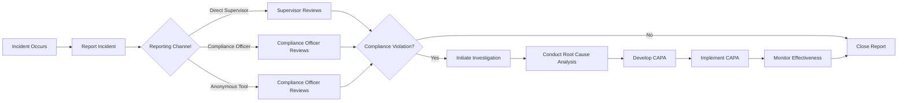

# LongLivesCicles_LLC
inteligencia evolutiva Path e.GAIA/AmpelRoboticsFleet/ML/AI/INSTINCT_FACTOR_IF/MACHINE_INSTINCT_LEARNING/lIntelligence_Evolution_IE/
Below is the **Updated Table of Contents** for the **GAIA AIR – Model AMPEL 360XWLRGA Compliance and Operational Training Program**, incorporating the newly added **Module 21: AMPEL Robotics Fleet Compliant Operative Rapid Platforms Systems (ARF CORPS)**. This comprehensive Table of Contents ensures that all training modules, key enhancements, and supplementary sections are organized systematically for easy navigation and reference.

---

# **GAIA AIR – Model AMPEL 360XWLRGA Compliance and Operational Training Program**

## **Table of Contents**

1. [Introduction](#1-introduction)
2. [Training Modules](#2-training-modules)
    - [Module 1: Introduction to Compliance Framework](#module-1-introduction-to-compliance-framework)
    - [Module 2: Regulatory Compliance](#module-2-regulatory-compliance)
    - [Module 3: Ethical Standards and Conduct](#module-3-ethical-standards-and-conduct)
    - [Module 4: Quality Management Systems](#module-4-quality-management-systems)
    - [Module 5: Environmental Sustainability](#module-5-environmental-sustainability)
    - [Module 6: Data Protection and Privacy](#module-6-data-protection-and-privacy)
    - [Module 7: Safety Protocols and Emergency Procedures](#module-7-safety-protocols-and-emergency-procedures)
    - [Module 8: Maintenance and Engineering](#module-8-maintenance-and-engineering)
    - [Module 9: Training and Development](#module-9-training-and-development)
    - [Module 10: Operational Management](#module-10-operational-management)
    - [Module 11: Risk Management](#module-11-risk-management)
    - [Module 12: Supply Chain Management](#module-12-supply-chain-management)
    - [Module 13: Information Technology Systems](#module-13-information-technology-systems)
    - [Module 14: Human Resources Management](#module-14-human-resources-management)
    - [Module 15: Financial Management](#module-15-financial-management)
    - [Module 16: Customer Relationship Management (CRM)](#module-16-customer-relationship-management-crm)
    - [Module 17: Marketing and Communications](#module-17-marketing-and-communications)
    - [Module 18: Legal Affairs and Contract Management](#module-18-legal-affairs-and-contract-management)
    - [Module 19: Innovation and Research & Development (R&D)](#module-19-innovation-and-research-development-rd)
    - [Module 20: Ampel Compliant and Operational Robotics Systems (Ampel CORS)](#module-20-ampel-compliant-and-operational-robotics-systems-ampel-cors)
    - [Module 21: AMPEL Robotics Fleet Compliant Operative Rapid Platforms Systems (ARF CORPS)](#module-21-ampel-robotics-fleet-compliant-operative-rapid-platforms-systems-arf-corps)
3. [Key Enhancements](#3-key-enhancements)
    - [Cross-Module Integration](#cross-module-integration)
    - [Detailed Content Expansion](#detailed-content-expansion)
    - [Enhanced Interactive Elements](#enhanced-interactive-elements)
    - [Diverse Assessment Methods](#diverse-assessment-methods)
    - [Continuous Feedback Mechanisms](#continuous-feedback-mechanisms)
    - [Certification and Recognition](#certification-and-recognition)
    - [Resource Compilation](#resource-compilation)
    - [Alignment with Existing Compliance Framework](#alignment-with-existing-compliance-framework)
    - [Technology Utilization](#technology-utilization)
4. [Sample Enhanced Module: Environmental Sustainability](#sample-enhanced-module-environmental-sustainability)
5. [Implementation Plan](#5-implementation-plan)
    - [Training Schedule](#training-schedule)
    - [Assessment Overview](#assessment-overview)
    - [Tools and Technology](#tools-and-technology)
    - [Evaluation and Improvement](#evaluation-and-improvement)
6. [Conclusion](#6-conclusion)
7. [Next Steps](#7-next-steps)
8. [Appendices](#8-appendices)

---

## **1. Introduction**

Welcome to the **GAIA AIR – Model AMPEL 360XWLRGA Compliance and Operational Training Program**. This program is meticulously crafted to equip all team members with the necessary knowledge and skills to uphold the highest standards of compliance, ethics, quality, environmental sustainability, data protection, and safety. Through structured modules, interactive activities, and assessments, you will gain a comprehensive understanding of the compliance framework essential for our project's success and integrity in the aerospace industry.

---

## **2. Training Modules**

### **Module 1: Introduction to Compliance Framework**

#### **Objective**
Understand the purpose and scope of the Compliance Framework.

#### **Content**
- **Overview of Compliance Principles**
    - Introduction to the fundamental concepts and significance of compliance within the aviation industry.
    - Importance of compliance in ensuring safety, quality, and legal adherence.
- **Compliance Policies and Procedures**
    - Detailed documentation outlining organizational compliance standards and protocols.
    - How policies are developed, reviewed, and updated.
- **Roles and Responsibilities**
    - Clearly defined roles for all personnel to ensure accountability in maintaining compliance.
    - Responsibilities of Compliance Officers, Project Managers, Team Members, and Senior Management.
- **Compliance Culture**
    - Strategies to foster a culture of compliance throughout the organization.
    - Encouraging ethical behavior and adherence to standards.
- **Compliance Monitoring**
    - Tools and methods for ongoing monitoring of compliance adherence.
    - Utilizing compliance management software and regular inspections.

#### **Activities**
- **Icebreaker Discussion**
    - **Description:** Share personal experiences where compliance positively or negatively impacted a workplace environment.
    - **Purpose:** Highlight real-world implications of compliance and its importance.
- **Interactive Presentation**
    - **Description:** Use slides to present the importance of compliance, GAIA AIR’s mission, and key principles.
    - **Purpose:** Provide visual and structured information to reinforce understanding.

#### **Assessment**
- **Quiz**
    - **Description:** Short quiz to assess understanding of the Compliance Framework’s purpose and key principles.
    - **Format:** Multiple-choice and true/false questions.

---

### **Module 2: Regulatory Compliance**

#### **Objective**
Gain in-depth knowledge of specific laws and regulations relevant to the project.

#### **Content**
- **Understanding Aviation Regulations**
    - Comprehensive study of local, national, and international aviation laws and regulations.
    - Detailed review of FAA (Federal Aviation Administration), EASA (European Union Aviation Safety Agency), and ICAO (International Civil Aviation Organization) regulations.
- **Certification Requirements**
    - Processes for obtaining, renewing, and maintaining necessary aviation certifications.
    - Understanding the steps involved in certification audits and compliance checks.
- **Regulatory Bodies Interaction**
    - Guidelines for effective communication and cooperation with aviation regulatory authorities.
    - Best practices for submitting reports and documentation to regulatory bodies.
- **Compliance Audits**
    - Procedures for conducting regular audits to assess adherence to regulatory standards.
    - Developing audit checklists and conducting internal reviews.
- **Documentation and Reporting**
    - Systems for maintaining accurate records and timely reporting to regulatory bodies.
    - Importance of traceability and version control in compliance documentation.
- **International Regulatory Differences**
    - Strategies for navigating global aviation regulations.
    - Understanding regional compliance nuances.
- **Emerging Regulations**
    - Preparing for upcoming changes in aviation compliance.
    - Staying informed about potential regulatory updates and their implications.

#### **Activities**
- **Case Studies**
    - **Description:** Review and discuss real or hypothetical cases of regulatory compliance.
    - **Purpose:** Apply theoretical knowledge to practical scenarios and understand the consequences of non-compliance.
- **Scenario-Based Learning**
    - **Description:** Analyze scenarios to identify compliance requirements and appropriate responses.
    - **Purpose:** Enhance decision-making skills in compliance contexts.

#### **Assessment**
- **Scenario Analysis Questions**
    - **Description:** Evaluate how to respond to specific situations based on regulatory requirements.
    - **Format:** Open-ended questions requiring detailed responses.

---

### **Module 3: Ethical Standards and Conduct**

#### **Objective**
Understand and uphold high ethical standards in all project activities.

#### **Content**
- **Code of Ethics**
    - Comprehensive guidelines outlining acceptable and expected behaviors within the organization.
    - Emphasis on integrity, honesty, and professionalism.
- **Conflict of Interest Policies**
    - Procedures for identifying, disclosing, and managing potential conflicts of interest.
    - Ensuring impartiality and fairness in decision-making.
- **Whistleblower Protections**
    - Mechanisms to protect individuals who report unethical behavior or breaches.
    - Ensuring confidentiality and protection against retaliation.
- **Ethics Training Programs**
    - Regular training sessions to educate employees on ethical standards and expectations.
    - Incorporating ethics into daily operations and long-term planning.
- **Enforcement and Disciplinary Actions**
    - Clear protocols for addressing ethical violations and enforcing consequences.
    - Ensuring consistency and fairness in disciplinary measures.

#### **Activities**
- **Role-Playing**
    - **Description:** Simulate situations demonstrating ethical and unethical behaviors.
    - **Purpose:** Practice ethical decision-making and appropriate responses in a controlled environment.
- **Group Discussions**
    - **Description:** Discuss the importance of ethics in maintaining project integrity.
    - **Purpose:** Foster a collective understanding of ethical standards and their application.

#### **Assessment**
- **Ethical Decision-Making Quiz**
    - **Description:** Assess understanding of ethical standards and appropriate responses.
    - **Format:** Scenario-based questions with multiple-choice answers.

---

### **Module 4: Quality Management Systems**

#### **Objective**
Ensure adherence to quality standards and continuous improvement.

#### **Content**
- **Overview of ISO 9001 and AS9100 Standards**
    - Understanding the principles and requirements of ISO 9001 (Quality Management Systems) and AS9100 (Aerospace Quality Management Systems).
    - Importance of these standards in maintaining high-quality deliverables.
- **Quality Assurance Practices**
    - Processes for maintaining and improving quality across all project activities.
    - Techniques such as inspections, testing, and quality audits.
- **Continuous Improvement Methodologies**
    - Strategies for ongoing enhancement of processes and systems using methodologies like PDCA (Plan-Do-Check-Act), Lean, Six Sigma, and Kaizen.
    - Encouraging a culture of innovation and excellence.
- **Performance Metrics**
    - Key indicators to measure quality performance and effectiveness.
    - Utilizing metrics to identify areas for improvement and track progress.
- **Customer Feedback Integration**
    - Systems to incorporate customer feedback into quality improvement initiatives.
    - Leveraging feedback to enhance customer satisfaction and product/service quality.

#### **Activities**
- **Quality Control Exercises**
    - **Description:** Practical tasks to apply quality management principles in real-world scenarios.
    - **Purpose:** Develop hands-on experience in quality assurance and control.
- **Interactive Workshops**
    - **Description:** Collaborate on developing quality improvement plans based on current processes.
    - **Purpose:** Encourage teamwork and innovative thinking in quality management.

#### **Assessment**
- **Quality Management Quiz**
    - **Description:** Test knowledge of quality standards, assurance practices, and continuous improvement methodologies.
    - **Format:** Multiple-choice and matching questions.

---

### **Module 5: Environmental Sustainability**

#### **Objective**
Promote environmental responsibility and compliance with environmental regulations, while fostering sustainable practices within the project.

#### **Content**
- **ISO 14001 Standards**
    - Detailed breakdown of ISO 14001 requirements.
    - Benefits of implementing an Environmental Management System (EMS).
- **Emission Controls**
    - Advanced technologies for monitoring and reducing emissions.
    - Case studies on successful emission reduction initiatives.
- **Waste Management**
    - Comprehensive strategies for waste segregation, recycling, and disposal.
    - Implementing circular economy principles in project operations.
- **Energy Efficiency Initiatives**
    - Innovations in energy-efficient aircraft systems.
    - Best practices for reducing energy consumption in ground operations.
- **Sustainable Practices Implementation**
    - Integrating sustainability into procurement, manufacturing, and maintenance processes.
    - Leveraging renewable energy sources and sustainable materials.
- **Environmental Impact Assessments**
    - Regular assessments to evaluate and mitigate the environmental impact of operations.
    - Ensuring compliance with environmental regulations and standards.

#### **Activities**
- **Sustainability Brainstorming Session**
    - **Description:** Teams brainstorm innovative ideas to enhance environmental sustainability within their specific project areas.
    - **Purpose:** Encourage creative thinking and ownership of sustainability initiatives.
- **Interactive Discussion**
    - **Description:** Discuss the impact of sustainability on project success and industry reputation.
    - **Purpose:** Reinforce the importance of environmental responsibility and collective effort.

#### **Assessment**
- **Sustainability Action Plan Development**
    - **Description:** Participants develop a detailed action plan outlining specific steps to implement sustainable practices in their roles.
    - **Purpose:** Apply theoretical knowledge to practical, actionable strategies.
- **Quiz**
    - **Description:** Test understanding of ISO 14001 standards, emission controls, and sustainable practices.
    - **Format:** Multiple-choice and scenario-based questions.

---

### **Module 6: Data Protection and Privacy**

#### **Objective**
Ensure the protection and privacy of sensitive data.

#### **Content**
- **GDPR and Other Data Protection Regulations**
    - Understanding the General Data Protection Regulation (GDPR) and other relevant data privacy laws.
    - Compliance obligations for handling personal and sensitive data.
- **Data Security Measures (Encryption, Access Controls)**
    - Implementing robust data security measures to safeguard information.
    - Utilizing encryption, firewalls, and role-based access controls to protect data integrity and confidentiality.
- **Best Practices for Handling Sensitive Information**
    - Procedures for secure data collection, storage, processing, and disposal.
    - Ensuring data is accessed only by authorized personnel.
- **Data Management Systems**
    - Tools and processes for managing and securing data efficiently.
    - Leveraging data management software to enhance data protection.
- **Incident Response Plans**
    - Procedures for responding to data breaches or security incidents effectively.
    - Minimizing the impact of data breaches through timely and coordinated responses.

#### **Activities**
- **Data Protection Workshops**
    - **Description:** Learn about data security technologies, best practices, and regulatory requirements.
    - **Purpose:** Enhance understanding of data protection measures and their implementation.
- **Scenario-Based Learning**
    - **Description:** Address data protection challenges in hypothetical scenarios to apply knowledge practically.
    - **Purpose:** Develop problem-solving skills related to data protection and privacy issues.

#### **Assessment**
- **Data Protection Quiz**
    - **Description:** Assess understanding of data protection laws, security measures, and best practices.
    - **Format:** Multiple-choice and true/false questions.

---

### **Module 7: Safety Protocols and Emergency Procedures**

#### **Objective**
Maintain a safe working environment and effectively handle emergencies.

#### **Content**
- **Safety Management Systems (SMS)**
    - A structured framework for managing safety risks proactively.
    - Key components of SMS: Safety Policy, Safety Risk Management, Safety Assurance, and Safety Promotion.
- **Emergency Response Plans**
    - Detailed plans outlining procedures for various emergency scenarios, including evacuation, medical emergencies, and system failures.
    - Coordination with local emergency services and stakeholders.
- **Incident Reporting Systems**
    - Mechanisms for documenting, analyzing, and learning from safety incidents and near-misses.
    - Ensuring timely reporting and effective incident management.
- **Safety Training Programs**
    - Regular training to ensure all personnel are knowledgeable about safety protocols and emergency procedures.
    - Incorporating hands-on training, simulations, and drills.
- **Safety Audits and Assessments**
    - Routine evaluations to identify and address potential safety hazards.
    - Utilizing safety checklists and audit tools to ensure comprehensive assessments.

#### **Activities**
- **Safety Drills**
    - **Description:** Participate in simulated emergency scenarios to practice response procedures.
    - **Purpose:** Reinforce understanding of emergency protocols and improve readiness.
- **Interactive Training**
    - **Description:** Learn about safety equipment, protocols, and best practices through hands-on sessions.
    - **Purpose:** Familiarize team members with safety tools and procedures.

#### **Assessment**
- **Safety Protocol Quiz**
    - **Description:** Test knowledge of safety standards, emergency procedures, and incident reporting.
    - **Format:** Multiple-choice and scenario-based questions.

---

### **Module 8: Maintenance and Engineering**

#### **Objective**
Ensure the aircraft systems are maintained in optimal condition and engineering standards are upheld.

#### **Content**
- **Preventive Maintenance Schedules**
    - Timelines and procedures for regular maintenance to prevent equipment failures.
    - Importance of adhering to maintenance schedules to ensure aircraft reliability and safety.
- **Troubleshooting Procedures**
    - Step-by-step guides to identify and resolve technical issues efficiently.
    - Utilizing diagnostic tools and techniques to troubleshoot system malfunctions.
- **Engineering Standards and Documentation**
    - Guidelines and records to ensure consistency and quality in engineering practices.
    - Maintaining detailed engineering documentation for traceability and compliance.
- **Maintenance Management Systems**
    - Software and tools to track maintenance activities, schedules, and histories.
    - Enhancing maintenance efficiency and record-keeping through digital systems.
- **Compliance with Maintenance Regulations**
    - Ensuring all maintenance activities meet regulatory and safety standards.
    - Understanding and adhering to FAA, EASA, and other relevant maintenance regulations.

#### **Activities**
- **Maintenance Simulation Exercises**
    - **Description:** Engage in simulated maintenance tasks to apply preventive maintenance schedules.
    - **Purpose:** Develop practical maintenance skills and adherence to schedules.
- **Troubleshooting Workshops**
    - **Description:** Collaborate on diagnosing and resolving technical issues using troubleshooting procedures.
    - **Purpose:** Enhance problem-solving abilities in engineering contexts.

#### **Assessment**
- **Maintenance and Engineering Quiz**
    - **Description:** Assess understanding of maintenance schedules, troubleshooting procedures, and engineering standards.
    - **Format:** Multiple-choice and practical scenario questions.

---

### **Module 9: Training and Development**

#### **Objective**
Enhance the skills and knowledge of team members through continuous training and development.

#### **Content**
- **Pilot and Crew Training Programs**
    - Comprehensive training modules for flight and ground crew, including simulator sessions and safety drills.
    - Ensuring pilots and crew are proficient in operating aircraft systems and handling emergencies.
- **Technical Training Modules**
    - Education on aircraft systems, maintenance procedures, and operational protocols.
    - Providing technical expertise to support aircraft performance and reliability.
- **Compliance Training Sessions**
    - Regular sessions to keep staff updated on compliance-related topics and changes in regulations.
    - Reinforcing the importance of adherence to compliance standards.
- **Professional Development Opportunities**
    - Programs to support career growth and skill enhancement for all employees.
    - Offering workshops, seminars, and courses to foster continuous learning.
- **Training Evaluation and Feedback**
    - Systems to assess the effectiveness of training programs and incorporate feedback for improvement.
    - Utilizing surveys and performance metrics to measure training outcomes.

#### **Activities**
- **Training Needs Assessment**
    - **Description:** Identify skill gaps and training requirements through surveys and performance reviews.
    - **Purpose:** Tailor training programs to meet specific needs and enhance overall competency.
- **Interactive Training Sessions**
    - **Description:** Participate in hands-on training activities and simulations to apply learned concepts.
    - **Purpose:** Reinforce knowledge through practical application and experiential learning.

#### **Assessment**
- **Training Effectiveness Survey**
    - **Description:** Collect feedback on training programs to assess their impact and effectiveness.
    - **Format:** Structured questionnaires and feedback forms.

---

### **Module 10: Operational Management**

#### **Objective**
Manage flight and ground operations efficiently to ensure seamless project execution.

#### **Content**
- **Flight Operations Management**
    - Coordination and oversight of all flight activities, including scheduling, dispatch, and in-flight operations.
    - Ensuring compliance with flight regulations and maintaining operational efficiency.
- **Ground Operations Coordination**
    - Management of ground services such as fueling, baggage handling, and catering.
    - Ensuring timely and efficient support for flight operations.
- **Resource Allocation Systems**
    - Tools for efficient distribution and utilization of resources, including personnel, equipment, and facilities.
    - Optimizing resource use to enhance operational performance.
- **Operational Performance Monitoring**
    - Metrics and systems to track and optimize operational efficiency and effectiveness.
    - Utilizing performance data to identify areas for improvement.
- **Operational Risk Management**
    - Identifying and mitigating risks associated with day-to-day operations.
    - Implementing strategies to prevent operational disruptions and ensure continuity.

#### **Activities**
- **Operations Planning Workshops**
    - **Description:** Develop detailed operational plans for flight and ground activities.
    - **Purpose:** Enhance planning and coordination skills to ensure smooth operations.
- **Resource Management Simulations**
    - **Description:** Engage in simulations to practice effective resource allocation and management.
    - **Purpose:** Improve decision-making in resource management scenarios.

#### **Assessment**
- **Operational Management Quiz**
    - **Description:** Test knowledge of flight and ground operations management, resource allocation systems, and performance monitoring.
    - **Format:** Multiple-choice and scenario-based questions.

---

### **Module 11: Risk Management**

#### **Objective**
Identify, assess, and mitigate risks to ensure project stability and success.

#### **Content**
- **Risk Assessment Frameworks**
    - Methods for identifying, evaluating, and prioritizing risks across all operations.
    - Utilizing tools like SWOT analysis, PESTLE analysis, and risk matrices.
- **Mitigation Strategies**
    - Plans and actions to minimize the impact of identified risks.
    - Implementing controls and contingency plans to address potential issues.
- **Risk Monitoring Tools**
    - Systems for continuous tracking and management of risks.
    - Utilizing software and dashboards to monitor risk indicators in real-time.
- **Crisis Management Planning**
    - Preparing for and responding to high-impact, low-probability events.
    - Developing comprehensive crisis management plans to ensure swift and effective responses.
- **Risk Communication Protocols**
    - Ensuring effective communication of risks and mitigation measures to all stakeholders.
    - Establishing clear channels for reporting and discussing risks.

#### **Activities**
- **Risk Identification Workshops**
    - **Description:** Collaborate to identify potential risks in various project areas.
    - **Purpose:** Foster a proactive approach to risk management by recognizing potential threats early.
- **Mitigation Strategy Development**
    - **Description:** Develop and implement strategies to mitigate identified risks.
    - **Purpose:** Enhance preparedness and response capabilities to manage risks effectively.

#### **Assessment**
- **Risk Management Quiz**
    - **Description:** Assess understanding of risk identification, assessment, mitigation strategies, and monitoring.
    - **Format:** Multiple-choice and practical scenario questions.

---

### **Module 12: Supply Chain Management**

#### **Objective**
Manage the supply chain effectively to ensure timely and quality delivery of materials and services.

#### **Content**
- **Vendor Compliance Requirements**
    - Standards and criteria that suppliers must meet to ensure quality and reliability.
    - Conducting supplier evaluations and audits to verify compliance.
- **Inventory Control Systems**
    - Tools for managing inventory levels, turnover rates, and replenishment processes.
    - Utilizing inventory management software to optimize stock levels and reduce waste.
- **Logistics and Procurement Processes**
    - Procedures for acquiring, transporting, and storing materials and components.
    - Ensuring efficient and cost-effective procurement practices.
- **Supply Chain Risk Management**
    - Identifying and mitigating risks within the supply chain, including disruptions and quality issues.
    - Developing contingency plans to address potential supply chain disruptions.
- **Supplier Relationship Management**
    - Building and maintaining positive relationships with suppliers to ensure collaboration and reliability.
    - Implementing performance metrics to assess and enhance supplier performance.

#### **Activities**
- **Vendor Assessment Exercises**
    - **Description:** Evaluate potential suppliers based on compliance and quality standards.
    - **Purpose:** Ensure reliable and compliant sourcing of materials and services.
- **Inventory Management Simulations**
    - **Description:** Engage in simulations to practice effective inventory control and management.
    - **Purpose:** Improve inventory management skills and decision-making.

#### **Assessment**
- **Supply Chain Management Quiz**
    - **Description:** Test knowledge of vendor compliance, inventory control, logistics, and procurement processes.
    - **Format:** Multiple-choice and matching questions.

---

### **Module 13: Information Technology Systems**

#### **Objective**
Ensure robust IT systems are in place to support all operational and compliance activities.

#### **Content**
- **IT Infrastructure Management**
    - Oversight of hardware, networks, and other technological resources essential for operations.
    - Ensuring the reliability and scalability of IT infrastructure to meet project demands.
- **Software and Application Support**
    - Maintenance and support for operational software, including updates and troubleshooting.
    - Implementing software solutions to enhance operational efficiency and compliance.
- **Cybersecurity Measures**
    - Protections against cyber threats, including firewalls, encryption, and intrusion detection systems.
    - Developing and implementing cybersecurity policies and procedures.
- **Data Backup and Recovery**
    - Systems to ensure data integrity and availability in case of failures or disasters.
    - Regularly testing backup and recovery processes to ensure effectiveness.
- **IT Compliance and Governance**
    - Ensuring IT practices adhere to relevant laws, regulations, and internal policies.
    - Establishing governance structures to oversee IT compliance and security.

#### **Activities**
- **Cybersecurity Training Sessions**
    - **Description:** Learn about cybersecurity best practices, threat mitigation, and response strategies.
    - **Purpose:** Enhance awareness and preparedness against cyber threats.
- **IT Systems Workshops**
    - **Description:** Participate in workshops on managing and maintaining IT infrastructure and software applications.
    - **Purpose:** Develop technical skills in IT systems management and support.

#### **Assessment**
- **IT Systems Quiz**
    - **Description:** Assess knowledge of IT infrastructure, software support, cybersecurity measures, and data recovery processes.
    - **Format:** Multiple-choice and scenario-based questions.

---

### **Module 14: Human Resources Management**

#### **Objective**
Manage human resources effectively to foster a productive and compliant workforce.

#### **Content**
- **Recruitment and Hiring Processes**
    - Strategies for attracting, selecting, and onboarding qualified talent.
    - Ensuring compliance with labor laws and diversity hiring practices.
- **Employee Relations Policies**
    - Guidelines for maintaining positive workplace relationships and addressing conflicts.
    - Implementing policies to promote a respectful and inclusive work environment.
- **Performance Management Systems**
    - Tools for evaluating employee performance, providing feedback, and facilitating development.
    - Conducting regular performance reviews and setting clear performance expectations.
- **Compensation and Benefits Administration**
    - Managing salaries, benefits, and incentives to attract and retain talent.
    - Ensuring competitive and equitable compensation structures.
- **Training and Development Programs**
    - Initiatives to support continuous learning and career advancement for employees.
    - Offering workshops, seminars, and courses to enhance skills and knowledge.

#### **Activities**
- **HR Policy Review Sessions**
    - **Description:** Review and discuss HR policies to ensure understanding and adherence.
    - **Purpose:** Promote awareness of HR standards and practices.
- **Performance Evaluation Workshops**
    - **Description:** Engage in role-playing exercises to practice conducting performance evaluations.
    - **Purpose:** Enhance skills in employee performance management and feedback.

#### **Assessment**
- **HR Management Quiz**
    - **Description:** Test knowledge of recruitment, employee relations, performance management, and compensation administration.
    - **Format:** Multiple-choice and scenario-based questions.

---

### **Module 15: Financial Management**

#### **Objective**
Manage financial resources effectively to ensure project sustainability and compliance.

#### **Content**
- **Budgeting and Forecasting**
    - Planning financial resources and predicting future financial needs and trends.
    - Utilizing budgeting tools and techniques to create accurate financial plans.
- **Cost Control Mechanisms**
    - Strategies to manage and reduce expenses without compromising quality or safety.
    - Implementing cost monitoring and reporting systems to track spending.
- **Financial Reporting Tools**
    - Systems for tracking, analyzing, and reporting financial performance and health.
    - Utilizing software solutions for efficient financial management and reporting.
- **Investment and Capital Planning**
    - Managing investments and capital expenditures to support growth and operational needs.
    - Evaluating investment opportunities and making informed financial decisions.
- **Financial Compliance and Auditing**
    - Ensuring all financial practices comply with relevant laws and standards.
    - Undergoing regular financial audits to verify accuracy and compliance.

#### **Activities**
- **Budget Planning Exercises**
    - **Description:** Develop detailed project budgets and financial forecasts.
    - **Purpose:** Enhance budgeting and financial planning skills.
- **Cost Control Workshops**
    - **Description:** Collaborate on identifying and implementing cost-saving measures.
    - **Purpose:** Foster effective cost management strategies and optimize financial resources.

#### **Assessment**
- **Financial Management Quiz**
    - **Description:** Assess understanding of budgeting, cost control, financial reporting, and compliance.
    - **Format:** Multiple-choice and practical scenario questions.

---

### **Module 16: Customer Relationship Management (CRM)**

#### **Objective**
Manage customer relationships effectively to enhance satisfaction and loyalty.

#### **Content**
- **Customer Service Protocols**
    - Standards for interacting with and assisting customers to ensure satisfaction and loyalty.
    - Implementing service level agreements (SLAs) to define response times and service expectations.
- **Feedback Systems**
    - Mechanisms for collecting, analyzing, and acting upon customer feedback and suggestions.
    - Utilizing surveys, feedback forms, and direct communication channels to gather insights.
- **Loyalty Programs**
    - Initiatives designed to reward and retain repeat customers, enhancing long-term relationships.
    - Developing programs that offer incentives, discounts, and exclusive benefits to loyal customers.
- **Customer Data Management**
    - Secure handling and analysis of customer data to personalize services and improve experiences.
    - Implementing data segmentation and targeted marketing strategies based on customer data.
- **Customer Support Channels**
    - Diverse platforms (e.g., phone, email, chat) to provide accessible and efficient customer support.
    - Ensuring multi-channel support to cater to different customer preferences and needs.

#### **Activities**
- **Customer Service Role-Playing**
    - **Description:** Simulate customer interactions to practice service protocols and effective communication.
    - **Purpose:** Improve customer service skills and adherence to protocols.
- **Feedback Analysis Workshops**
    - **Description:** Analyze customer feedback to identify areas for improvement and implement changes.
    - **Purpose:** Enhance ability to interpret and act on customer insights to improve service quality.

#### **Assessment**
- **CRM Quiz**
    - **Description:** Assess knowledge of customer service protocols, feedback systems, and loyalty programs.
    - **Format:** Multiple-choice and scenario-based questions.

---

### **Module 17: Marketing and Communications**

#### **Objective**
Promote services and maintain effective communication channels to support project success.

#### **Content**
- **Marketing Strategies**
    - Comprehensive plans to promote services, enhance brand presence, and attract customers.
    - Utilizing market research to inform marketing initiatives and target audiences effectively.
- **Public Relations Management**
    - Handling media relations, press releases, and managing the organization’s public image.
    - Developing strategies for positive media coverage and crisis communication.
- **Digital Marketing Initiatives**
    - Utilizing online platforms, social media, and digital advertising to reach target audiences.
    - Implementing SEO (Search Engine Optimization) and SEM (Search Engine Marketing) strategies to increase online visibility.
- **Internal Communications Systems**
    - Tools and protocols for effective communication within the organization, ensuring transparency and alignment.
    - Implementing intranet systems, newsletters, and regular team meetings to facilitate information sharing.
- **Market Research and Analysis**
    - Gathering and analyzing data to understand market trends, customer needs, and competitive landscape.
    - Utilizing tools like surveys, focus groups, and analytics software to inform decision-making.

#### **Activities**
- **Marketing Campaign Planning**
    - **Description:** Develop comprehensive marketing campaigns aligned with project goals and target audiences.
    - **Purpose:** Enhance strategic planning and execution skills in marketing.
- **Public Relations Simulations**
    - **Description:** Engage in simulations to practice handling media inquiries and managing public image.
    - **Purpose:** Improve PR skills and crisis communication capabilities.

#### **Assessment**
- **Marketing and Communications Quiz**
    - **Description:** Assess knowledge of marketing strategies, public relations management, and internal communications.
    - **Format:** Multiple-choice and scenario-based questions.

---

### **Module 18: Legal Affairs and Contract Management**

#### **Objective**
Manage legal affairs and contracts effectively to ensure compliance and protect project interests.

#### **Content**
- **Contract Drafting and Review**
    - Procedures for creating, evaluating, and approving contracts to ensure legal compliance and protect interests.
    - Understanding key contract clauses and their implications.
- **Legal Compliance**
    - Ensuring all operations adhere to applicable laws, regulations, and industry standards.
    - Monitoring changes in laws and regulations to update practices accordingly.
- **Dispute Resolution Mechanisms**
    - Processes for resolving legal conflicts, including mediation, arbitration, and litigation management.
    - Developing strategies for preventing disputes through clear communication and documentation.
- **Intellectual Property Management**
    - Protecting and managing the organization’s intellectual property rights and assets.
    - Filing patents, trademarks, and copyrights to safeguard innovations and branding.
- **Legal Risk Management**
    - Identifying and mitigating legal risks associated with operations, contracts, and strategic initiatives.
    - Implementing controls to prevent legal breaches and minimize potential liabilities.

#### **Activities**
- **Contract Review Exercises**
    - **Description:** Analyze and critique sample contracts to identify potential issues and ensure compliance.
    - **Purpose:** Develop skills in contract evaluation and negotiation.
- **Dispute Resolution Role-Playing**
    - **Description:** Simulate legal dispute scenarios to practice resolution techniques.
    - **Purpose:** Enhance abilities in managing and resolving conflicts effectively.

#### **Assessment**
- **Legal Affairs Quiz**
    - **Description:** Test knowledge of contract management, legal compliance, and dispute resolution.
    - **Format:** Multiple-choice and scenario-based questions.

---

### **Module 19: Innovation and Research & Development (R&D)**

#### **Objective**
Foster innovation and manage R&D activities to drive project advancement and competitiveness.

#### **Content**
- **R&D Projects Management**
    - Oversight of research initiatives and innovation projects, including planning, execution, and evaluation.
    - Ensuring R&D efforts align with project goals and market needs.
- **Technology Integration**
    - Incorporating new technologies into existing systems to enhance performance and capabilities.
    - Evaluating and adopting emerging technologies to maintain a competitive edge.
- **Intellectual Property Development**
    - Creating and protecting new inventions, processes, and technologies.
    - Managing patents, trademarks, and copyrights to secure intellectual property.
- **Innovation Culture Promotion**
    - Fostering an environment that encourages creativity, experimentation, and continuous improvement.
    - Implementing programs and incentives to motivate innovative thinking among team members.
- **Collaboration with External Partners**
    - Engaging with universities, research institutions, and industry partners to drive innovation.
    - Establishing partnerships to leverage external expertise and resources for R&D initiatives.

#### **Activities**
- **Innovation Workshops**
    - **Description:** Brainstorm and develop innovative solutions to project challenges.
    - **Purpose:** Encourage creative thinking and problem-solving to drive innovation.
- **R&D Project Planning Sessions**
    - **Description:** Develop detailed plans for R&D projects, including objectives, timelines, and resource allocation.
    - **Purpose:** Enhance project management skills in an R&D context and ensure successful project execution.

#### **Assessment**
- **Innovation and R&D Quiz**
    - **Description:** Assess knowledge of R&D project management, technology integration, and intellectual property management.
    - **Format:** Multiple-choice and practical scenario questions.

---

### **Module 20: Ampel Compliant and Operational Robotics Systems (Ampel CORS)**

#### **Objective**
Equip team members with the knowledge and skills to ensure that the AmpelRoboticsFleet operates in compliance with regulatory standards, maintains operational efficiency, and integrates seamlessly within the GAIA ecosystem.

#### **Content**

##### **20.1. Introduction to Ampel CORS**
- **Definition:** Ampel Compliant and Operational Robotics Systems (Ampel CORS) is a specialized framework ensuring that all robotic systems within the AmpelRoboticsFleet adhere to compliance standards, operate efficiently, and integrate harmoniously with the GAIA ecosystem.
- **Importance:** Ensures reliability, safety, and regulatory adherence of robotic operations, enhancing overall project integrity and performance.

##### **20.2. Compliance Standards for Robotics**
- **Aerospace Standards:**
  - **FAA FAR Part 25:** Airworthiness Standards for Transport Category Airplanes.
  - **EASA CS-25:** Certification Specifications for Large Aeroplanes.
- **Robotics-Specific Regulations:**
  - **ISO 10218:** Safety Requirements for Industrial Robots.
  - **ANSI/RIA R15.06:** American National Standard for Safety Requirements for Industrial Robots and Robot Systems.
- **Data Protection in Robotics:**
  - **GDPR Compliance:** Ensuring data collected by robots is handled in accordance with data protection laws.
  - **Cybersecurity Measures:** Implementing secure communication protocols to protect robotic systems from cyber threats.

##### **20.3. Operational Efficiency in Robotics**
- **Autonomous Navigation:**
  - **AI/ML Algorithms:** Enhancing route optimization and obstacle avoidance.
  - **Sensor Integration:** Utilizing LIDAR, cameras, and other sensors for environmental perception.
- **Maintenance Protocols:**
  - **Predictive Maintenance:** Using ML models to predict and prevent robotic failures.
  - **Regular Inspections:** Scheduled checks to ensure robotic systems are functioning optimally.
- **Energy Management:**
  - **Battery Efficiency:** Implementing energy-efficient systems to prolong operational time.
  - **Charging Stations Integration:** Seamless integration with support infrastructure for uninterrupted operations.

##### **20.4. Integration with GAIA Ecosystem**
- **DataFlow Coordination:**
  - **Central Control Unit (CCU):** Real-time telemetry and command coordination.
  - **Quantum Enhanced Communication (QECM):** Secure data transmission between robots and control systems.
  - **Global Avionics, Schematics, Sensing (GASS):** Enhanced situational awareness and environmental data integration.
- **System Adaptation:**
  - **Airframe Architectures and Materials (AAMDM):** Ensuring robotic systems are compatible with advanced materials and structural designs.
  - **Innovation and R&D:** Continuous improvement of robotic technologies through research and development initiatives.

##### **20.5. Safety Protocols for Robotics**
- **Redundant Systems:**
  - **Dual-Control Mechanisms:** Ensuring backup systems are in place to take over in case of primary system failures.
  - **Fail-Safe Operations:** Automatic shutdown or safe state transitions during malfunctions.
- **Emergency Response Integration:**
  - **Quick Shutdown Procedures:** Rapid response systems to halt robotic operations during emergencies.
  - **Coordination with Safety Protocols:** Aligning robotic emergency responses with overall safety procedures.
- **Human-Robot Interaction Safety:**
  - **Collaborative Safety Features:** Ensuring safe interactions between humans and robots in shared environments.
  - **Training for Operators:** Educating personnel on safe operation and emergency handling of robotic systems.

##### **20.6. Documentation and Traceability**
- **Comprehensive Logs:**
  - **Operation Logs:** Detailed records of all robotic operations, commands, and statuses.
  - **Maintenance Logs:** Documentation of all maintenance activities, inspections, and repairs.
- **Audit Trails:**
  - **Compliance Audits:** Regular audits to verify adherence to compliance standards.
  - **Performance Reviews:** Periodic assessments of robotic system performance and efficiency.
- **Certification Records:**
  - **Regulatory Certifications:** Maintaining up-to-date certifications for all robotic systems.
  - **Quality Assurance Documentation:** Ensuring all systems meet quality management standards.

#### **Activities**

##### **20.7.1. Compliance Workshop**
- **Description:** Interactive workshop focused on understanding and applying compliance standards specific to robotics within the aerospace industry.
- **Purpose:** Ensure participants can identify relevant regulations and implement compliance measures in robotic operations.
- **Format:** Presentation followed by group discussions and Q&A sessions.

##### **20.7.2. Operational Efficiency Simulation**
- **Description:** Hands-on simulation where participants optimize robotic routes and perform maintenance tasks using AI/ML tools.
- **Purpose:** Develop practical skills in enhancing operational efficiency and predictive maintenance.
- **Format:** Virtual lab environment with guided exercises.

##### **20.7.3. Safety Protocol Drill**
- **Description:** Conduct emergency response drills specifically for robotic system failures, including fail-safe activations and shutdown procedures.
- **Purpose:** Reinforce safety protocols and ensure readiness for handling robotic emergencies.
- **Format:** Role-playing and live demonstrations.

#### **Assessment**

##### **20.8.1. Compliance Knowledge Quiz**
- **Description:** Assess understanding of compliance standards and their application in robotic systems.
- **Format:** Multiple-choice and true/false questions covering regulatory requirements and best practices.

##### **20.8.2. Operational Efficiency Project**
- **Description:** Participants develop and present an optimized operational plan for a robotic fleet segment, incorporating AI/ML algorithms for route optimization and predictive maintenance.
- **Purpose:** Evaluate ability to apply theoretical knowledge to practical, real-world scenarios.
- **Format:** Group project with a presentation and written report.

##### **20.8.3. Safety Protocol Evaluation**
- **Description:** Participants demonstrate the execution of safety protocols during a simulated robotic system failure.
- **Purpose:** Assess proficiency in implementing safety measures and responding to emergencies.
- **Format:** Practical demonstration assessed by trainers.

---

### **Module 21: AMPEL Robotics Fleet Compliant Operative Rapid Platforms Systems (ARF CORPS)**

#### **Objective**
Equip team members with the knowledge and skills to ensure that the Ampel Robotics Fleet operates efficiently, safely, and in compliance with all relevant standards within the GAIA ecosystem. This module focuses on the rapid deployment, operational management, and compliance of robotic platforms, ensuring they meet the project's high standards for performance and reliability.

#### **Content**

##### **21.1. Introduction to ARF CORPS**
- **Definition:** 
  - **AMPEL Robotics Fleet Compliant Operative Rapid Platforms Systems (ARF CORPS)** is a specialized framework designed to ensure that all robotic platforms within the Ampel Robotics Fleet are compliant with industry standards, operate efficiently, and integrate seamlessly with the GAIA ecosystem.
- **Importance:**
  - Ensures reliability, safety, and regulatory adherence of robotic operations.
  - Enhances overall project integrity and performance through standardized operational protocols.

##### **21.2. Compliance Standards for ARF CORPS**
- **Aerospace Standards:**
  - **FAA FAR Part 25:** Airworthiness Standards for Transport Category Airplanes.
  - **EASA CS-25:** Certification Specifications for Large Aeroplanes.
- **Robotics-Specific Regulations:**
  - **ISO 10218:** Safety Requirements for Industrial Robots.
  - **ANSI/RIA R15.06:** American National Standard for Safety Requirements for Industrial Robots and Robot Systems.
- **Data Protection in Robotics:**
  - **GDPR Compliance:** Ensuring data collected by robots is handled in accordance with data protection laws.
  - **Cybersecurity Measures:** Implementing secure communication protocols to protect robotic systems from cyber threats.

##### **21.3. Operational Efficiency in ARF CORPS**
- **Autonomous Navigation:**
  - **AI/ML Algorithms:** Enhancing route optimization and obstacle avoidance.
  - **Sensor Integration:** Utilizing LIDAR, cameras, and other sensors for environmental perception.
- **Maintenance Protocols:**
  - **Predictive Maintenance:** Using ML models to predict and prevent robotic failures.
  - **Regular Inspections:** Scheduled checks to ensure robotic systems are functioning optimally.
- **Energy Management:**
  - **Battery Efficiency:** Implementing energy-efficient systems to prolong operational time.
  - **Charging Stations Integration:** Seamless integration with support infrastructure for uninterrupted operations.

##### **21.4. Integration with GAIA Ecosystem**
- **DataFlow Coordination:**
  - **Central Control Unit (CCU):** Real-time telemetry and command coordination.
  - **Quantum Enhanced Communication (QECM):** Secure data transmission between robots and control systems.
  - **Global Avionics, Schematics, Sensing (GASS):** Enhanced situational awareness and environmental data integration.
- **System Adaptation:**
  - **Airframe Architectures and Materials (AAMDM):** Ensuring robotic systems are compatible with advanced materials and structural designs.
  - **Innovation and R&D:** Continuous improvement of robotic technologies through research and development initiatives.

##### **21.5. Safety Protocols for ARF CORPS**
- **Redundant Systems:**
  - **Dual-Control Mechanisms:** Ensuring backup systems are in place to take over in case of primary system failures.
  - **Fail-Safe Operations:** Automatic shutdown or safe state transitions during malfunctions.
- **Emergency Response Integration:**
  - **Quick Shutdown Procedures:** Rapid response systems to halt robotic operations during emergencies.
  - **Coordination with Safety Protocols:** Aligning robotic emergency responses with overall safety procedures.
- **Human-Robot Interaction Safety:**
  - **Collaborative Safety Features:** Ensuring safe interactions between humans and robots in shared environments.
  - **Training for Operators:** Educating personnel on safe operation and emergency handling of robotic systems.

##### **21.6. Documentation and Traceability**
- **Comprehensive Logs:**
  - **Operation Logs:** Detailed records of all robotic operations, commands, and statuses.
  - **Maintenance Logs:** Documentation of all maintenance activities, inspections, and repairs.
- **Audit Trails:**
  - **Compliance Audits:** Regular audits to verify adherence to compliance standards.
  - **Performance Reviews:** Periodic assessments of robotic system performance and efficiency.
- **Certification Records:**
  - **Regulatory Certifications:** Maintaining up-to-date certifications for all robotic systems.
  - **Quality Assurance Documentation:** Ensuring all systems meet quality management standards.

##### **21.7. Risk Management in ARF CORPS**
- **Risk Identification:**
  - **Potential Risks:** System failures, cybersecurity threats, operational inefficiencies.
  - **Impact Assessment:** Evaluating the severity and likelihood of identified risks.
- **Mitigation Strategies:**
  - **Proactive Measures:** Implementing redundant systems, regular maintenance, and robust cybersecurity protocols.
  - **Contingency Planning:** Developing plans to address and recover from potential incidents.
- **Continuous Monitoring:**
  - **Real-Time Tracking:** Utilizing monitoring tools to oversee robotic operations and detect anomalies.
  - **Feedback Loops:** Incorporating feedback from operations to refine risk management strategies.

##### **21.8. Compliance and Certification Process**
- **Initial Certification:**
  - **Documentation Preparation:** Compiling necessary documentation to meet compliance standards.
  - **Testing and Validation:** Conducting thorough testing to ensure systems meet required specifications.
- **Ongoing Compliance:**
  - **Regular Audits:** Scheduling and conducting audits to maintain certification status.
  - **Updates and Improvements:** Continuously enhancing systems to comply with evolving standards and incorporate technological advancements.

#### **Activities**

##### **21.9.1. Compliance Workshop**
- **Description:** Interactive workshop focused on understanding and applying compliance standards specific to ARF CORPS within the aerospace industry.
- **Purpose:** Ensure participants can identify relevant regulations and implement compliance measures in robotic operations.
- **Format:** Presentation followed by group discussions and Q&A sessions.

##### **21.9.2. Operational Efficiency Simulation**
- **Description:** Hands-on simulation where participants optimize robotic routes and perform maintenance tasks using AI/ML tools.
- **Purpose:** Develop practical skills in enhancing operational efficiency and predictive maintenance.
- **Format:** Virtual lab environment with guided exercises.

##### **21.9.3. Safety Protocol Drill**
- **Description:** Conduct emergency response drills specifically for robotic system failures, including fail-safe activations and shutdown procedures.
- **Purpose:** Reinforce safety protocols and ensure readiness for handling robotic emergencies.
- **Format:** Role-playing and live demonstrations.

#### **Assessment**

##### **21.10.1. Compliance Knowledge Quiz**
- **Description:** Assess understanding of compliance standards and their application in robotic systems.
- **Format:** Multiple-choice and true/false questions covering regulatory requirements and best practices.

##### **21.10.2. Operational Efficiency Project**
- **Description:** Participants develop and present an optimized operational plan for a robotic fleet segment, incorporating AI/ML algorithms for route optimization and predictive maintenance.
- **Purpose:** Evaluate ability to apply theoretical knowledge to practical, real-world scenarios.
- **Format:** Group project with a presentation and written report.

##### **21.10.3. Safety Protocol Evaluation**
- **Description:** Participants demonstrate the execution of safety protocols during a simulated robotic system failure.
- **Purpose:** Assess proficiency in implementing safety measures and responding to emergencies.
- **Format:** Practical demonstration assessed by trainers.

---

## **3. Key Enhancements**

### **Cross-Module Integration**

#### **Interlinking Modules**
Creating connections between related modules provides a cohesive learning experience, reinforcing key concepts and their applications across different areas.

- **Example 1:**
  - **Module 6: Data Protection and Privacy** references **Module 3: Ethical Standards and Conduct** to emphasize the ethical handling of sensitive data.
  
- **Example 2:**
  - **Module 2: Regulatory Compliance** aligns with **Module 4: Quality Management Systems** to illustrate how regulatory standards influence quality assurance practices.

### **Detailed Content Expansion**

#### **In-Depth Coverage**
Enhancing modules with additional topics ensures a comprehensive understanding of each subject area.

- **Module 2: Regulatory Compliance**
    - **International Regulatory Differences**
        - Strategies for navigating global aviation regulations.
        - Understanding regional compliance nuances.
    - **Emerging Regulations**
        - Preparing for upcoming changes in aviation compliance.
        - Staying informed about potential regulatory updates and their implications.

### **Enhanced Interactive Elements**

#### **Real-Life Case Studies**
Incorporating aviation-specific scenarios contextualizes compliance and ethical standards, making the training more relevant and engaging.

#### **Group Projects**
Collaborative development of compliance strategies for hypothetical situations fosters teamwork and practical application of learned concepts.

### **Diverse Assessment Methods**

#### **Variety in Assessments**
Incorporating multiple assessment types evaluates different skills and ensures a well-rounded understanding.

- **Assignments:**
  - Analyze specific compliance scenarios through written tasks.
  
- **Presentations:**
  - Participants present module topics to encourage active learning and public speaking skills.
  
- **Peer Reviews:**
  - Implement peer assessments to enhance critical thinking and feedback capabilities.

### **Continuous Feedback Mechanisms**

#### **Regular Feedback Sessions**
Periodic meetings for participants to share insights and suggestions ensure the training program remains effective and relevant.

#### **Surveys**
Anonymous post-training surveys gather honest feedback on program effectiveness and areas for improvement, facilitating continuous enhancement.

### **Certification and Recognition**

#### **Completion Certificates**
Awarded upon successful program completion to motivate participants and add value to their professional development.

#### **Digital Badges**
Earned for completing individual modules, suitable for showcasing on professional profiles like LinkedIn, enhancing participants' credentials.

### **Resource Compilation**

#### **Additional Resources**
Links to relevant regulations, standards documents, industry publications, and further reading materials are provided within each module to support ongoing learning.

#### **Glossary**
A comprehensive glossary of key terms and acronyms used throughout the training aids comprehension and serves as a quick reference tool.

### **Alignment with Existing Compliance Framework**

#### **Consistency with Compliance Documents**
Seamless integration with the **Regulatory Compliance Dossier (Regulatory-DC.md)** and other GAIA AIR documentation reinforces the compliance culture across all organizational materials.

### **Technology Utilization**

#### **Learning Management System (LMS)**
Hosting the training program on platforms like Moodle, Coursera for Business, or LinkedIn Learning provides centralized access, progress tracking, and automated reminders, enhancing the training experience.

#### **Interactive Tools**
Utilizing tools such as Kahoot! for live quizzes and Mentimeter for live polling increases participant engagement and makes learning more dynamic.

---

## **4. Sample Enhanced Module: Environmental Sustainability**

*(As detailed in Module 5 above)*

---

## **5. Implementation Plan**

### **Training Schedule**

| **Training Module**                      | **Frequency** | **Format**              | **Trainer**                 |
|------------------------------------------|---------------|-------------------------|-----------------------------|
| Introduction to Compliance Framework     | Annually      | Workshop                | Compliance Officer          |
| Regulatory Compliance                    | Biannually    | Seminar                 | Regulatory Specialist       |
| Ethical Standards and Conduct            | Quarterly     | Interactive Session     | Ethics Manager              |
| Quality Management Systems               | Ongoing       | Online Training         | Quality Assurance Manager   |
| Environmental Sustainability             | Annually      | Webinar                 | Environmental Manager       |
| Data Protection and Privacy              | Quarterly     | E-Learning Module       | Data Protection Officer     |
| Safety Protocols and Emergency Procedures| As Needed     | Role-Playing Session    | Safety Coordinator          |
| Maintenance and Engineering              | Quarterly     | Practical Workshop      | Maintenance Manager         |
| Training and Development                 | Ongoing       | Online and In-Person    | Training Coordinator        |
| Operational Management                   | Monthly       | Workshop                | Operations Manager          |
| Risk Management                          | Quarterly     | Seminar                 | Risk Manager                |
| Supply Chain Management                  | Quarterly     | Interactive Workshop    | Supply Chain Manager        |
| Information Technology Systems           | Ongoing       | Online and Practical    | IT Manager                  |
| Human Resources Management               | Annually      | Workshop                | HR Manager                  |
| Financial Management                     | Biannually    | Seminar                 | Finance Manager             |
| Customer Relationship Management (CRM)   | Quarterly     | Interactive Session     | CRM Specialist              |
| Marketing and Communications             | Biannually    | Workshop                | Marketing Manager           |
| Legal Affairs and Contract Management    | Quarterly     | Seminar                 | Legal Advisor               |
| Innovation and Research & Development (R&D)| Annually    | Workshop                | R&D Manager                 |
| Ampel Compliant and Operational Robotics Systems (Ampel CORS) | Annually | Robotics Compliance Officer | Workshop            |
| AMPEL Robotics Fleet Compliant Operative Rapid Platforms Systems (ARF CORPS) | Annually | ARF CORPS Compliance Officer | Workshop        |

### **Assessment Overview**

| **Assessment Type**    | **Purpose**                                       |
|------------------------|---------------------------------------------------|
| Quizzes                | Measure knowledge retention and understanding.    |
| Assignments            | Test practical application of theoretical knowledge. |
| Group Projects         | Foster teamwork and real-world problem solving.    |
| Presentations          | Encourage active learning and public speaking skills. |
| Peer Reviews           | Enhance critical thinking and feedback capabilities. |

### **Tools and Technology**

- **LMS Platform:**
  - Host training materials, track progress, and automate reminders using platforms like Moodle, Coursera for Business, or LinkedIn Learning.
  
- **Interactive Tools:**
  - Use Kahoot! for live quizzes and Mentimeter for live polling to increase participant engagement.
  
- **Visualization Tools:**
  - Incorporate data visualizations for regulatory trends using tools like Tableau or Power BI to enhance understanding.

### **Evaluation and Improvement**

- **Compliance Matrix:**
  - Track alignment with regulatory standards and monitor progress across all modules.
  
- **Feedback Mechanism:**
  - Collect participant feedback via surveys and group discussions to identify areas for improvement.
  
- **Audit Checklist:**
  - Regularly review content and alignment with industry updates to ensure the training program remains current and effective.

---

## **6. Conclusion**

The enhanced **Compliance and Operational Training Program** is a vital component of the **GAIA AIR – Model AMPEL 360XWLRGA** project, ensuring that all team members are well-prepared to uphold compliance standards, maintain ethical conduct, manage quality, and achieve operational excellence. By actively participating in these modules, engaging in interactive activities, and completing assessments, participants contribute significantly to the project's success and integrity within the aerospace industry.

---

## **7. Next Steps**

1. **Implement the Training Program:**
   - Roll out the training modules according to the schedule, ensuring all team members are enrolled and engaged.
   
2. **Monitor Progress:**
   - Use the Compliance Matrix and Training Schedule to track participation and completion rates.
   
3. **Gather Feedback:**
   - After each module, collect feedback to identify areas for improvement and make necessary adjustments.
   
4. **Continuous Improvement:**
   - Regularly update the training program to reflect new regulations, technologies, and project needs.

---

## **8. Appendices**

### **Appendix A: Compliance Matrix Example**

| **Compliance Condition**          | **Project Component**          | **Responsible Team Member** | **Deadline**  | **Status**    |
|-----------------------------------|---------------------------------|------------------------------|----------------|---------------|
| FAA Part 21                       | Aircraft Design Specifications  | Lead Engineer                | Q2 2025        | In Progress   |
| ISO 9001 Compliance               | Quality Management Processes    | Quality Assurance Manager    | Ongoing        | Ongoing       |
| GDPR Compliance                   | Customer Data Handling          | Data Protection Officer      | Immediate      | Completed     |
| Environmental Standards           | Emissions Control Systems       | Environmental Manager        | Q3 2025        | Planned       |
| OSHA Compliance                   | Workplace Safety Procedures     | Safety Manager               | Ongoing        | Ongoing       |
| ISO 14001 Compliance              | Environmental Management Systems| Environmental Manager        | Ongoing        | Ongoing       |
| AS9100 Compliance                 | Quality Assurance Practices     | Quality Assurance Manager    | Ongoing        | Ongoing       |
| Data Security Measures            | IT Systems Management           | IT Manager                   | Immediate      | Completed     |
| Crisis Management Plans           | Emergency Response Procedures   | Safety Coordinator           | Q4 2025        | Planned       |
| Supplier Compliance               | Supply Chain Management         | Supply Chain Manager         | Ongoing        | Ongoing       |
| Contract Compliance               | Legal Affairs and Contract Mgmt.| Legal Advisor                | Ongoing        | Ongoing       |
| R&D Compliance                    | Innovation and R&D              | R&D Manager                  | Ongoing        | Ongoing       |
| Customer Feedback                 | CRM Systems                     | CRM Specialist               | Ongoing        | Ongoing       |
| Marketing Compliance              | Marketing and Communications    | Marketing Manager            | Ongoing        | Ongoing       |
| Data Backup Systems               | IT Infrastructure Management    | IT Manager                   | Immediate      | Completed     |
| Crisis Management                 | Emergency Response Procedures   | Safety Coordinator           | Q4 2025        | Planned       |
| Legal Risk Management             | Legal Affairs and Contract Mgmt.| Legal Advisor                | Ongoing        | Ongoing       |
| Innovation Risk Management        | Innovation and R&D              | R&D Manager                  | Ongoing        | Ongoing       |
| Employee Training Compliance      | Training and Development        | Training Coordinator         | Ongoing        | Ongoing       |
| Ampel CORS Compliance             | Ampel Robotics Fleet Systems    | Robotics Compliance Officer  | Q1 2026        | Planned       |
| ARF CORPS Compliance              | ARF CORPS Systems               | ARF CORPS Compliance Officer | Q2 2026        | Planned       |

### **Appendix B: Compliance Training Schedule**

| **Training Module**                         | **Frequency** | **Responsible Trainer**       | **Format**              |
|---------------------------------------------|---------------|-------------------------------|-------------------------|
| Introduction to Compliance Framework        | Annually      | Compliance Officer            | Workshop                |
| Regulatory Compliance                       | Biannually    | Regulatory Specialist         | Seminar                 |
| Ethical Standards and Conduct               | Quarterly     | Ethics Manager                | Interactive Session     |
| Quality Management Systems                  | Ongoing       | Quality Assurance Manager     | Online Training         |
| Environmental Sustainability                | Annually      | Environmental Manager         | Webinar                 |
| Data Protection and Privacy                 | Quarterly     | Data Protection Officer       | E-Learning Module       |
| Safety Protocols and Emergency Procedures   | As Needed     | Safety Coordinator            | Role-Playing Session    |
| Maintenance and Engineering                 | Quarterly     | Maintenance Manager           | Practical Workshop      |
| Training and Development                    | Ongoing       | Training Coordinator          | Online and In-Person    |
| Operational Management                      | Monthly       | Operations Manager            | Workshop                |
| Risk Management                             | Quarterly     | Risk Manager                  | Seminar                 |
| Supply Chain Management                     | Quarterly     | Supply Chain Manager          | Interactive Workshop    |
| Information Technology Systems              | Ongoing       | IT Manager                    | Online and Practical    |
| Human Resources Management                  | Annually      | HR Manager                    | Workshop                |
| Financial Management                        | Biannually    | Finance Manager               | Seminar                 |
| Customer Relationship Management (CRM)      | Quarterly     | CRM Specialist                | Interactive Session     |
| Marketing and Communications                | Biannually    | Marketing Manager             | Workshop                |
| Legal Affairs and Contract Management       | Quarterly     | Legal Advisor                 | Seminar                 |
| Innovation and Research & Development (R&D) | Annually      | R&D Manager                   | Workshop                |
| Ampel Compliant and Operational Robotics Systems (Ampel CORS) | Annually | Robotics Compliance Officer | Workshop                |
| AMPEL Robotics Fleet Compliant Operative Rapid Platforms Systems (ARF CORPS) | Annually | ARF CORPS Compliance Officer | Workshop        |

### **Appendix C: Compliance Audit Checklist**

#### **Document Compliance Checklist**
- [ ] Consistent formatting and numbering
- [ ] Clear and concise language
- [ ] Version control implementation
- [ ] Accessibility to authorized personnel

#### **Dossier Compliance Checklist**
- [ ] Comprehensive technical specifications
- [ ] Alignment with FAA, EASA, ICAO regulations
- [ ] Inclusion of test results and certification information

#### **Internal Audit Procedures**
1. **Define Audit Scope and Objectives**
2. **Develop Audit Schedule**
3. **Conduct Audits Using Standardized Checklists**
4. **Document Findings and Recommendations**
5. **Track Corrective Actions**

### **Appendix D: Incident Reporting Flowchart**

### **Appendix E: Glossary**

| **Term**                    | **Definition**                                                                                   |
|-----------------------------|---------------------------------------------------------------------------------------------------|
| **CAPA**                    | Corrective and Preventive Actions                                                                |
| **CRM**                     | Customer Relationship Management                                                                 |
| **EMS**                     | Environmental Management System                                                                  |
| **GDPR**                    | General Data Protection Regulation                                                               |
| **ISO**                     | International Organization for Standardization                                                   |
| **LMS**                     | Learning Management System                                                                        |
| **OSHA**                    | Occupational Safety and Health Administration                                                    |
| **SMS**                     | Safety Management System                                                                          |
| **SWOT Analysis**           | Strengths, Weaknesses, Opportunities, Threats Analysis                                           |
| **PESTLE Analysis**         | Political, Economic, Social, Technological, Legal, Environmental Analysis                        |
| **PDCA**                    | Plan-Do-Check-Act Cycle                                                                           |
| **AI/ML**                   | Artificial Intelligence / Machine Learning                                                       |
| **IF**                      | Instinctive Factor                                                                                |
| **MIL**                     | Machine Instinct Learning                                                                         |
| **QECM**                    | Quantum Enhanced Communication Module                                                              |
| **ARF CORPS**               | AMPEL Robotics Fleet Compliant Operative Rapid Platforms Systems                                   |

---

# **Final Notes**

Implementing this **Enhanced Compliance and Operational Training Program** ensures that the **GAIA AIR – Model AMPEL 360XWLRGA** project operates within all required legal, ethical, and operational boundaries. Regular participation, active engagement in activities, and successful completion of assessments will significantly contribute to the project's success and integrity within the aerospace industry.

By adhering to these modules, your team will be well-prepared to navigate the complexities of aviation compliance, maintain high standards of quality and safety, and drive continuous improvement and innovation. This structured approach not only supports operational excellence but also reinforces the organization's commitment to ethical practices and regulatory adherence.

If you require further customization, additional modules, or specific enhancements to this training program, please feel free to reach out!

---

If you have any specific sections you'd like to modify, expand upon, or further develop within the **Table of Contents** or any other part of the training program, please let me know! I'm here to assist you in tailoring the program to best fit your project's needs.
